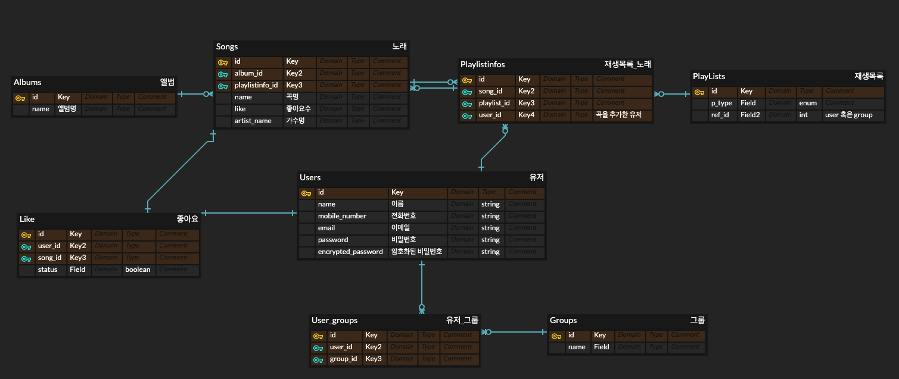

# Ringle Music 프로젝트

- 음원 정보를 검색하고 유저/그룹 재생목록을 관리하는 프로젝트
## 모델링


## Version
- Ruby 2.7.7
- Rails 6.1.7
- mySql 8.0.32
## API

- Grape를 이용하여 REST API 구현
- http://localhost:3000/api/v1/ 의 형식

## 구현 기능
- [x] 유저 API
  - 로그인 
  - 회원가입 
- [x] 음원 API
    - 음원 검색
        - 음원명 / 아티스트명 / 앨범명으로 검색
        - 옵션
          - 정확도순(기본)
          - 최신순
          - 인기순
- [x] 재생 목록 API
    - 유저별 재생목록 목록 조회
    - 그룹별 재생목록 조회
    - 재생목록 추가 / 삭제
    - 재생목록의 곡 추가 / 조회 / 삭제
    
- [x] 좋아요 API
    - 음원 좋아요 토글 기능
- [x] 그룹 API
    - 사용자가 속한 그룹 조회/탈퇴
    - 그룹별 사용자 이름 조회
    - 사용자 그룹 참여
    - 그룹 추가

## 프로젝트 진행기간
### 2023.03.28~2023.04.07

## 개발 환경 및 사용 기술
&nbsp;
&nbsp;
&nbsp;\
&nbsp;
&nbsp;\
&nbsp;

## 실행 방법(mac OS)
```
rails server
```
## 서버 주소
```
http://localhost:3000/
```

##  Swagger 주소
```
http://localhost:3000/api-ui/
```


